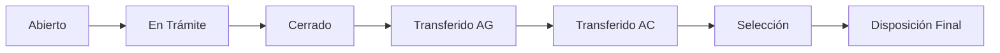

# 📘 MANUAL DE USUARIO COMPLETO - ArchiveyCloud SGDEA

**Sistema de Gestión Documental y Electrónica de Archivos**  
**Versión:** 1.0.0  
**Fecha:** Diciembre 2025  
**Desarrollado para:** Hospital Universitario del Valle / Entidades Colombianas  
**Cumplimiento:** Normativa AGN Colombia - 169 Requerimientos Implementados

---

## 📑 Tabla de Contenidos

### PARTE I - INTRODUCCIÓN Y ACCESO
1. [Introducción al Sistema](#1-introducción)
2. [Primeros Pasos y Acceso](#2-primeros-pasos)
3. [Autenticación de Dos Factores (2FA)](#3-autenticación-de-dos-factores-2fa)

### PARTE II - PANEL DE CONTROL
4. [Dashboard Ejecutivo](#4-panel-de-control-dashboard)
5. [Navegación y Menús](#5-navegación-del-sistema)

### PARTE III - ADMINISTRACIÓN DE USUARIOS
6. [Gestión de Usuarios](#6-gestión-de-usuarios-y-roles)
7. [Roles y Permisos del Sistema](#7-roles-y-permisos-detallados)
8. [Gestión de Roles (Super Admin)](#8-gestión-de-roles-super-admin)

### PARTE IV - GESTIÓN DOCUMENTAL
9. [Tablas de Retención Documental (TRD)](#9-tablas-de-retención-documental-trd)
10. [Cuadros de Clasificación Documental (CCD)](#10-cuadros-de-clasificación-documental-ccd)
11. [Series y Subseries Documentales](#11-series-y-subseries-documentales)

### PARTE V - EXPEDIENTES Y DOCUMENTOS
12. [Gestión de Expedientes](#12-gestión-de-expedientes)
13. [Expedientes Híbridos](#13-expedientes-híbridos)
14. [Gestión de Documentos](#14-gestión-de-documentos)
15. [Captura y Digitalización](#15-captura-y-digitalización)
16. [Firmas Digitales](#16-firmas-digitales)

### PARTE VI - BÚSQUEDA Y CONSULTAS
17. [Búsqueda Simple y Avanzada](#17-búsqueda-y-consultas)
18. [Búsqueda Semántica con IA](#18-búsqueda-semántica-con-ia)

### PARTE VII - FLUJOS DE TRABAJO
19. [Workflows y Aprobaciones](#19-workflows-y-aprobaciones)
20. [Editor Visual de Workflows](#20-editor-visual-de-workflows)

### PARTE VIII - REPORTES Y AUDITORÍA
21. [Reportes y Estadísticas](#21-reportes-y-estadísticas)
22. [Auditoría y Trazabilidad](#22-auditoría-y-trazabilidad)

### PARTE IX - ADMINISTRACIÓN AVANZADA
23. [Importaciones y Exportaciones](#23-importaciones-y-exportaciones)
24. [Configuración del Sistema](#24-configuración-del-sistema)
25. [API del Sistema](#25-api-del-sistema)

### PARTE X - SOPORTE
26. [Preguntas Frecuentes](#26-preguntas-frecuentes)
27. [Solución de Problemas](#27-solución-de-problemas)
28. [Glosario de Términos](#28-glosario-de-términos)

---

# PARTE I - INTRODUCCIÓN Y ACCESO

---

## 1. Introducción

### ¿Qué es ArchiveyCloud SGDEA?

ArchiveyCloud es un **Sistema de Gestión Documental y Electrónica de Archivos (SGDEA)** de clase mundial, diseñado para cumplir con la normativa archivística colombiana del Archivo General de la Nación (AGN) y facilitar la gestión integral del ciclo de vida de los documentos.

### 📊 Estadísticas del Sistema

| Métrica | Valor |
|---------|-------|
| **Requerimientos Implementados** | 169/169 (100%) |
| **Módulos Funcionales** | 8 módulos principales |
| **Servicios Backend** | 42 servicios especializados |
| **Componentes Frontend** | 10+ componentes avanzados |
| **Líneas de Código** | ~25,000 líneas |

### ✅ Características Principales

#### Gestión Documental
- ✅ **Gestión de TRD y CCD** conforme a normativa AGN
- ✅ **Expedientes electrónicos** con trazabilidad completa
- ✅ **Expedientes híbridos** (físico + digital)
- ✅ **Versionamiento de documentos** con historial completo
- ✅ **Índice electrónico** automático

#### Captura e Ingreso
- ✅ **Captura multicanal** (web, email, scanner)
- ✅ **OCR/ICR/HCR/OMR** avanzado para digitalización
- ✅ **Integración con scanners** profesionales
- ✅ **Captura automática de correos** electrónicos
- ✅ **Plantillas documentales** personalizables

#### Seguridad
- ✅ **Firmas digitales** (CADES, PADES, XADES)
- ✅ **Autenticación de dos factores (2FA)** - TOTP, Email, SMS
- ✅ **SSO (Single Sign-On)** - Google, Microsoft, Azure, GitHub
- ✅ **PKI completo** con certificados digitales
- ✅ **Control de accesos** granular por roles y permisos
- ✅ **Auditoría completa** de todas las acciones

#### Búsqueda y Recuperación
- ✅ **Búsqueda avanzada** con operadores booleanos
- ✅ **Búsqueda semántica** con Machine Learning
- ✅ **Elasticsearch** integrado para texto completo
- ✅ **Filtros facetados** y autocompletado

#### Flujos de Trabajo
- ✅ **Workflows paralelos** y secuenciales
- ✅ **Editor visual** de flujos de trabajo
- ✅ **Motor de reglas de negocio** (Business Rules Engine)
- ✅ **Escalamiento automático** de tareas

#### Reportes e Integración
- ✅ **Dashboard ejecutivo** con KPIs
- ✅ **Exportación** a PDF, Excel, CSV, XML
- ✅ **API RESTful** completa
- ✅ **Integración con sistemas externos**

### 💻 Requisitos del Sistema

**Para Usuarios:**
- Navegador moderno (Chrome 90+, Firefox 88+, Edge 90+, Safari 14+)
- Conexión a internet estable
- Resolución mínima: 1280x720 píxeles
- Credenciales de acceso proporcionadas por el administrador

**Para Administradores (Instalación):**
- PHP >= 8.2
- Node.js >= 18
- MySQL/MariaDB 8.0+
- Composer 2.x
- 4GB RAM mínimo (8GB recomendado)
- 50GB espacio en disco

---

## 2. Primeros Pasos

### 2.1 Acceso al Sistema

1. **Abrir el navegador** e ingresar a: `https://tu-dominio.com`

2. **Iniciar Sesión:**
   - Ingrese su correo electrónico
   - Ingrese su contraseña
   - Clic en "Iniciar Sesión"

   

3. **Autenticación de Dos Factores (2FA):**
   - Si tiene 2FA activado, escanee el código QR con Google Authenticator
   - Ingrese el código de 6 dígitos
   - Guarde los códigos de recuperación en lugar seguro

### 2.2 Primer Ingreso

**Si es su primer ingreso:**

1. Recibirá un correo de verificación
2. Haga clic en el enlace del correo
3. Su cuenta será verificada automáticamente
4. Podrá acceder al sistema

### 2.3 Recuperación de Contraseña

**Si olvidó su contraseña:**

1. Clic en "¿Olvidaste tu contraseña?"
2. Ingrese su correo electrónico
3. Revise su bandeja de entrada
4. Clic en el enlace del correo
5. Ingrese nueva contraseña (mínimo 8 caracteres)
6. Confirme la nueva contraseña

---

## 3. Autenticación de Dos Factores (2FA)

### 3.1 ¿Qué es 2FA?

La **Autenticación de Dos Factores** agrega una capa extra de seguridad a su cuenta. Además de su contraseña, necesitará un código temporal para iniciar sesión.

### 3.2 Métodos de 2FA Disponibles

| Método | Descripción | Recomendado |
|--------|-------------|-------------|
| **TOTP** | Google Authenticator, Microsoft Authenticator, Authy | ⭐ Sí |
| **Email** | Código enviado a su correo electrónico | Alternativo |
| **SMS** | Código enviado por mensaje de texto | Alternativo |

### 3.3 Activar 2FA con TOTP (Recomendado)

1. **Ir a:** Mi Perfil → Seguridad → Autenticación de Dos Factores
2. **Clic en:** "Activar 2FA"
3. **Seleccionar:** Método TOTP
4. **Escanear código QR** con su aplicación de autenticación:
   - Google Authenticator (Android/iOS)
   - Microsoft Authenticator
   - Authy
5. **Ingresar código** de 6 dígitos que muestra la app
6. **Guardar códigos de recuperación** (10 códigos únicos)

**⚠️ IMPORTANTE:** Guarde los códigos de recuperación en un lugar seguro. Son su única forma de acceder si pierde el dispositivo.

### 3.4 Activar 2FA por Email

1. **Ir a:** Mi Perfil → Seguridad → Autenticación de Dos Factores
2. **Clic en:** "Activar 2FA"
3. **Seleccionar:** Método Email
4. **Confirmar** su dirección de correo
5. **Recibirá un código** de verificación cada vez que inicie sesión

### 3.5 Usar 2FA al Iniciar Sesión

1. **Ingresar** correo y contraseña
2. **Sistema solicita** código 2FA
3. **Abrir** su app de autenticación
4. **Ingresar** el código de 6 dígitos
5. **Acceso concedido**

**El código cambia cada 30 segundos.** Si el código expira, espere al siguiente.

### 3.6 Códigos de Recuperación

**Si perdió acceso a su dispositivo 2FA:**

1. En la pantalla de verificación 2FA
2. **Clic en:** "Usar código de recuperación"
3. **Ingresar** uno de sus 10 códigos guardados
4. **Acceso concedido**
5. **Regenerar códigos** inmediatamente después

**Para regenerar códigos:**
1. Mi Perfil → Seguridad → 2FA
2. Clic en "Regenerar Códigos de Recuperación"
3. Guardar los nuevos códigos

### 3.7 Desactivar 2FA

1. **Ir a:** Mi Perfil → Seguridad → 2FA
2. **Clic en:** "Desactivar 2FA"
3. **Ingresar** código actual de verificación
4. **Confirmar** desactivación

**Nota:** Los administradores pueden requerir 2FA obligatorio para ciertos roles.

---

# PARTE II - PANEL DE CONTROL

---

## 4. Panel de Control (Dashboard)

### 3.1 Vista General

El dashboard muestra un resumen de la información más relevante según su rol:

#### Dashboard Ejecutivo (Super Admin/Admin)
- 📊 **Estadísticas Generales:**
  - Total de expedientes activos
  - Documentos capturados este mes
  - Transferencias pendientes
  - Alertas de retención

- 📈 **Gráficos:**
  - Distribución de documentos por serie
  - Tendencias de captura
  - Estado de expedientes

#### Dashboard Usuario
- 📁 **Mis Expedientes:** Expedientes asignados
- 📄 **Documentos Recientes:** Últimos documentos capturados
- ⏰ **Tareas Pendientes:** Aprobaciones, transferencias, etc.
- 🔔 **Notificaciones:** Alertas y mensajes del sistema

### 3.2 Navegación

**Menú Lateral (Sidebar):**
- 🏠 **Inicio:** Dashboard principal
- 📁 **Expedientes:** Gestión de expedientes
- 📄 **Documentos:** Gestión documental
- 📊 **TRD:** Tablas de Retención
- 🗂️ **CCD:** Cuadros de Clasificación
- 🔍 **Búsqueda:** Búsqueda simple y avanzada
- ⚙️ **Administración:** (Solo admins)
  - Usuarios y Roles
  - Configuración
  - Importaciones
  - Reportes

**Barra Superior:**
- 🔔 **Notificaciones:** Alertas en tiempo real
- 👤 **Perfil de Usuario:**
  - Ver perfil
  - Configuración personal
  - Activar 2FA
  - Cerrar sesión

---

## 4. Gestión de Usuarios y Roles

### 4.1 Roles del Sistema

#### 🔴 Super Administrador
- **Acceso total** al sistema
- Gestión de usuarios y roles
- Configuración del sistema
- Sin restricciones

#### 🟠 Administrador SGDEA
- Gestión de TRD y CCD
- Aprobación de expedientes
- Gestión de usuarios (limitado)
- Configuración de módulos

#### 🟡 Jefe de Archivo
- Supervisión de archivo de gestión
- Aprobación de transferencias
- Gestión de expedientes
- Reportes y estadísticas

#### 🟢 Archivista
- Gestión de expedientes
- Captura de documentos
- Organización y clasificación
- Consultas y préstamos

#### 🔵 Secretario
- Captura de documentos
- Creación de expedientes
- Consultas básicas

#### ⚪ Usuario Consulta
- Solo lectura
- Búsqueda y consulta
- Descarga de documentos (con permiso)

### 4.2 Gestionar Usuarios (Solo Administradores)

#### Crear Nuevo Usuario

1. **Ir a:** Administración → Usuarios
2. **Clic en:** "Crear Usuario" (botón azul)
3. **Llenar formulario:**
   ```
   Nombre: Juan Pérez
   Email: juan.perez@empresa.com
   Rol: Archivista
   ☑️ Verificar email automáticamente
   ```
4. **Clic en:** "Crear Usuario"

**Importante:** El usuario recibirá un correo con sus credenciales temporales.

#### Editar Usuario

1. **Buscar usuario** en la lista
2. **Clic en** ✏️ (editar)
3. **Modificar datos** necesarios
4. **Guardar cambios**

#### Eliminar Usuario

1. **Buscar usuario** en la lista
2. **Clic en** 🗑️ (eliminar)
3. **Confirmar eliminación**

**Nota:** El sistema usa **soft delete** - el usuario se marca como eliminado pero se mantiene el historial. El correo puede reutilizarse.

#### Filtros Disponibles

- 🔍 **Búsqueda:** Por nombre o email
- 📊 **Estado:**
  - Activos
  - Inactivos
  - Pendientes de verificación
  - Sin rol asignado

---

## 7. Roles y Permisos Detallados

### 7.1 Jerarquía de Roles del Sistema

El sistema cuenta con **8 roles predefinidos** organizados jerárquicamente:

```
┌─────────────────────────────────────┐
│   Super Administrador (Nivel 1)    │
└──────────────┬──────────────────────┘
               │
       ┌───────┴────────┐
       │                │
┌──────▼──────┐  ┌─────▼──────────────┐
│Administrador│  │Admin. de Seguridad │
│  (Nivel 2)  │  │     (Nivel 2)      │
└──────┬──────┘  └────────────────────┘
       │
       │         ┌────────────┐
       │         │  Auditor   │
       └────────►│ (Nivel 3)  │
                 └────────────┘
       │
┌──────▼──────┐
│ Supervisor  │
│  (Nivel 3)  │
└──────┬──────┘
       │
┌──────▼──────┐
│Coordinador  │
│  (Nivel 4)  │
└──────┬──────┘
       │
┌──────▼──────┐
│  Operativo  │
│  (Nivel 5)  │
└──────┬──────┘
       │
┌──────▼──────┐
│  Consulta   │
│  (Nivel 6)  │
└─────────────┘
```

### 7.2 Descripción Detallada de Roles

#### 🔴 Super Administrador (Nivel 1)
- **Acceso:** Total sin restricciones
- **Funciones:**
  - Control total del sistema
  - Gestión de otros Super Administradores
  - Configuración de políticas del sistema
  - Gestión de seguridad avanzada
- **Casos de uso:** Director de TI, Gerente General

#### 🟠 Administrador (Nivel 2)
- **Acceso:** Administración general
- **Funciones:**
  - Gestión de usuarios (excepto Super Admin)
  - Aprobación de TRD y CCD
  - Reportes avanzados
  - Supervisión de auditoría
- **Casos de uso:** Jefe de Archivo, Coordinador Administrativo

#### 🟠 Administrador de Seguridad (Nivel 2)
- **Acceso:** Especializado en seguridad
- **Funciones:**
  - Gestión de permisos y roles
  - Configuración de políticas de seguridad
  - Auditoría de accesos
  - Gestión de certificados digitales
- **Casos de uso:** Oficial de Seguridad, Auditor de Sistemas

#### 🟡 Supervisor (Nivel 3)
- **Acceso:** Supervisión de procesos
- **Funciones:**
  - Aprobación de series documentales
  - Supervisión de clasificación
  - Reportes operativos
  - Asignación de tareas
- **Casos de uso:** Supervisor de Archivo, Jefe de Sección

#### 🟢 Coordinador (Nivel 4)
- **Acceso:** Coordinación de actividades
- **Funciones:**
  - Creación y edición de TRD
  - Gestión de series documentales
  - Coordinación de clasificación
  - Gestión de expedientes
- **Casos de uso:** Coordinador de Archivo, Archivista Senior

#### 🔵 Operativo (Nivel 5)
- **Acceso:** Operaciones básicas
- **Funciones:**
  - Carga de documentos
  - Edición de metadatos básicos
  - Clasificación de documentos
  - Reportes simples
- **Casos de uso:** Auxiliar de Archivo, Técnico Documental

#### ⚪ Consulta (Nivel 6)
- **Acceso:** Solo lectura
- **Funciones:**
  - Búsqueda básica de documentos
  - Visualización de información
  - Exportación limitada
- **Casos de uso:** Usuario Final, Personal de Consulta

#### 🟣 Auditor (Nivel 3 - Independiente)
- **Acceso:** Auditoría completa
- **Funciones:**
  - Acceso completo a pistas de auditoría
  - Reportes de cumplimiento
  - Revisión de logs del sistema
  - Sin permisos de modificación
- **Casos de uso:** Auditor Interno, Control de Calidad

### 7.3 Matriz de Permisos por Rol

| Permiso | Super Admin | Admin | Admin Seg. | Supervisor | Coordinador | Operativo | Consulta | Auditor |
|---------|:-----------:|:-----:|:----------:|:----------:|:-----------:|:---------:|:--------:|:-------:|
| **ADMINISTRACIÓN** |
| Dashboard admin | ✅ | ✅ | ✅ | ✅ | 🟡 | ❌ | ❌ | ✅ |
| Configuración sistema | ✅ | ❌ | ❌ | ❌ | ❌ | ❌ | ❌ | ❌ |
| **USUARIOS** |
| Crear usuarios | ✅ | ✅ | ✅ | ❌ | ❌ | ❌ | ❌ | ❌ |
| Ver usuarios | ✅ | ✅ | ✅ | ✅ | 🟡 | ❌ | ❌ | ✅ |
| Editar usuarios | ✅ | ✅ | ✅ | ❌ | ❌ | ❌ | ❌ | ❌ |
| Eliminar usuarios | ✅ | ❌ | ❌ | ❌ | ❌ | ❌ | ❌ | ❌ |
| **TRD** |
| Crear TRD | ✅ | ✅ | ❌ | ✅ | ✅ | ❌ | ❌ | ❌ |
| Ver TRD | ✅ | ✅ | ✅ | ✅ | ✅ | ✅ | ✅ | ✅ |
| Editar TRD | ✅ | ✅ | ❌ | ✅ | ✅ | ❌ | ❌ | ❌ |
| Aprobar TRD | ✅ | ✅ | ❌ | ✅ | ❌ | ❌ | ❌ | ❌ |
| **DOCUMENTOS** |
| Crear documentos | ✅ | ✅ | ✅ | ✅ | ✅ | ✅ | ❌ | ❌ |
| Ver documentos | ✅ | ✅ | ✅ | ✅ | ✅ | ✅ | ✅ | ✅ |
| Editar documentos | ✅ | ✅ | ✅ | ✅ | ✅ | ✅ | ❌ | ❌ |
| Eliminar documentos | ✅ | ✅ | ❌ | ✅ | ❌ | ❌ | ❌ | ❌ |
| **BÚSQUEDA** |
| Búsqueda básica | ✅ | ✅ | ✅ | ✅ | ✅ | ✅ | ✅ | ✅ |
| Búsqueda avanzada | ✅ | ✅ | ✅ | ✅ | ✅ | ✅ | ❌ | ✅ |
| **AUDITORÍA** |
| Ver auditoría | ✅ | ✅ | ✅ | ❌ | ❌ | ❌ | ❌ | ✅ |
| Exportar auditoría | ✅ | ✅ | ✅ | ❌ | ❌ | ❌ | ❌ | ✅ |

**Leyenda:** ✅ = Permiso completo | 🟡 = Permiso limitado | ❌ = Sin permiso

### 7.4 Lista Completa de Permisos (54 permisos)

#### Administración
- `administracion.dashboard.ver`
- `administracion.configuracion.gestionar`

#### Usuarios
- `usuarios.crear`, `usuarios.ver`, `usuarios.editar`, `usuarios.eliminar`
- `usuarios.activar`, `usuarios.gestionar`

#### Roles
- `roles.crear`, `roles.editar`, `roles.eliminar`, `roles.asignar`

#### TRD
- `trd.crear`, `trd.ver`, `trd.editar`, `trd.aprobar`, `trd.exportar`

#### CCD
- `ccd.crear`, `ccd.ver`, `ccd.editar`

#### Series y Subseries
- `series.crear`, `series.ver`
- `subseries.crear`, `subseries.ver`

#### Expedientes
- `expedientes.crear`, `expedientes.ver`, `expedientes.editar`

#### Documentos
- `documentos.crear`, `documentos.ver`, `documentos.editar`

#### Plantillas
- `plantillas.crear`, `plantillas.ver`

#### Préstamos y Disposiciones
- `prestamos.ver`
- `disposiciones.ver`

#### Reportes y Auditoría
- `reportes.ver`, `reportes.generar`, `reportes.exportar`
- `auditoria.ver`, `auditoria.exportar`

#### Notificaciones e Índices
- `notificaciones.gestionar`
- `indices.ver`

#### Firmas y Workflow
- `firmas.gestionar`
- `workflow.gestionar`

#### Certificados, Importación y API
- `certificados.gestionar`
- `importacion.gestionar`
- `api.gestionar`

---

## 8. Gestión de Roles (Super Admin)

### 8.1 Acceso a Gestión de Roles

**Solo el Super Administrador puede gestionar roles y permisos.**

1. **Ir a:** Administración → Usuarios
2. **Clic en:** Botón "Gestionar Roles" (esquina superior)
3. **O acceder directamente:** `/admin/roles`

### 8.2 Interfaz de Gestión de Roles

```
┌─────────────────────────────────────────────────┐
│  Header: "Gestión de Roles y Permisos"         │
│  [Botón: Guardar Cambios] (si hay cambios)     │
├─────────────────────────────────────────────────┤
│  Alerta: Solo Super Admin puede modificar      │
├──────────────────┬──────────────────────────────┤
│  Listado Roles   │  Permisos del Rol           │
│  ┌────────────┐  │  ┌───────────────────────┐  │
│  │ Super      │  │  │ [Tabs por Categoría]  │  │
│  │ Admin      │  │  │                       │  │
│  │ (54 perm.) │  │  │ ☑ Permiso 1          │  │
│  ├────────────┤  │  │ ☑ Permiso 2          │  │
│  │ Administra │  │  │ ☐ Permiso 3          │  │
│  │ dor        │  │  │ ...                  │  │
│  │ (26 perm.) │  │  └───────────────────────┘  │
│  └────────────┘  │                              │
└──────────────────┴──────────────────────────────┘
```

### 8.3 Modificar Permisos de un Rol

1. **Seleccionar rol** en la columna izquierda
2. **Navegar por tabs** de categorías de permisos
3. **Marcar/desmarcar** permisos individuales
4. **O usar** "Seleccionar todos" por categoría
5. **Clic en** "Guardar Cambios"

### 8.4 Categorías de Permisos

- **Administración** - Dashboard y configuración
- **Usuarios** - Gestión de usuarios
- **Seguridad** - Roles y permisos
- **Clasificación** - TRD, CCD, Series
- **Expedientes** - Gestión de expedientes
- **Plantillas** - Plantillas documentales
- **Préstamos** - Préstamos y consultas
- **Disposiciones** - Disposición final
- **Reportes** - Reportes y estadísticas
- **Notificaciones** - Sistema de alertas
- **Índices** - Índices electrónicos
- **Firmas** - Firmas digitales
- **Workflow** - Flujos de trabajo
- **API** - Acceso a API
- **Certificados** - Certificados digitales
- **Importación** - Importación de datos
- **Búsqueda** - Funciones de búsqueda
- **Auditoría** - Pistas de auditoría
- **Retención** - Políticas de retención

### 8.5 Protección del Super Administrador

⚠️ **El rol Super Administrador NO puede ser modificado.**

- Siempre tiene todos los permisos
- Los checkboxes están deshabilitados
- Esto es por seguridad del sistema

### 8.6 Efectos de los Cambios

**Cuando modifica permisos de un rol:**

1. **Todos los usuarios** con ese rol se ven afectados
2. Los cambios aplican **después de cerrar sesión**
3. Los usuarios deben **volver a iniciar sesión**
4. El **sidebar se actualiza** automáticamente

---

# PARTE IV - GESTIÓN DOCUMENTAL

---

## 9. Tablas de Retención Documental (TRD)

### 5.1 ¿Qué es una TRD?

La **Tabla de Retención Documental** es el instrumento archivístico que define:
- Series y subseries documentales
- Tiempos de retención en cada fase
- Disposición final de los documentos

### 5.2 Estados de una TRD

- 📝 **Borrador:** En construcción
- ✅ **Activa:** Aprobada y en uso
- ⏸️ **Inactiva:** Temporalmente suspendida
- 📦 **Archivada:** Obsoleta, solo consulta

### 5.3 Crear una TRD

#### Paso 1: Información Básica

1. **Ir a:** Administración → TRD
2. **Clic en:** "Nueva TRD"
3. **Llenar datos:**
   ```
   Código: TRD-2025-001
   Nombre: Tabla de Retención Principal 2025
   Descripción: TRD para gestión administrativa
   Versión: 1.0
   Fecha Inicio Vigencia: 01/01/2025
   Fecha Fin Vigencia: 31/12/2029
   ```

#### Paso 2: Agregar Series Documentales

1. **En la TRD creada,** clic en "Agregar Serie"
2. **Datos de la serie:**
   ```
   Código: 100
   Nombre: Documentos Administrativos
   Dependencia: Secretaría General
   Descripción: Serie para documentos administrativos
   ```

#### Paso 3: Agregar Subseries

1. **Dentro de la serie,** clic en "Agregar Subserie"
2. **Datos de subserie:**
   ```
   Código: 100-01
   Nombre: Correspondencia General
   Descripción: Comunicaciones oficiales
   ```

#### Paso 4: Configurar Retención

1. **Para cada subserie,** definir:
   ```
   Archivo de Gestión: 2 años
   Archivo Central: 5 años
   Disposición Final: Conservación Total
   ```

**Opciones de Disposición Final:**
- 📚 **Conservación Total:** Preservar permanentemente
- 🗑️ **Eliminación:** Destruir tras retención
- 🔍 **Selección:** Evaluar caso por caso
- 🏛️ **Transferencia Histórica:** Al archivo histórico
- 💾 **Digitalización y Eliminación:** Digital permanente

#### Paso 5: Aprobar TRD

1. **Verificar datos** completos
2. **Clic en** "Aprobar TRD"
3. **La TRD pasa a estado "Activa"**

### 5.4 Versionar TRD

**Cuando necesite modificar una TRD aprobada:**

1. **Abrir TRD** a modificar
2. **Clic en** "Nueva Versión"
3. **Sistema crea** versión 2.0 en borrador
4. **Realizar cambios** necesarios
5. **Aprobar** nueva versión
6. **Versión anterior** se archiva automáticamente

### 5.5 Importar/Exportar TRD

#### Exportar TRD a XML

1. **Abrir TRD** deseada
2. **Clic en** "Exportar"
3. **Seleccionar formato:** XML
4. **Descargar archivo**

#### Importar TRD desde XML

1. **Ir a:** Importaciones → TRD
2. **Seleccionar archivo** XML
3. **Clic en** "Importar"
4. **Verificar** resultados de validación
5. **Revisar** errores si los hay

---

## 6. Cuadros de Clasificación Documental (CCD)

### 6.1 ¿Qué es un CCD?

El **Cuadro de Clasificación Documental** es la estructura jerárquica que organiza la documentación en 5 niveles:

1. **Fondo:** Nivel más alto (ej: Ministerio de Educación)
2. **Sección:** División administrativa (ej: Dirección General)
3. **Subsección:** Subdivisión (ej: Subdirección Técnica)
4. **Serie:** Agrupación documental (ej: Contratos)
5. **Subserie:** Especificación (ej: Contratos de Prestación de Servicios)

### 6.2 Visualizar CCD

**El sistema muestra el CCD como árbol interactivo:**

```
📁 Ministerio de Educación (Fondo)
├─ 📂 Dirección General (Sección)
│  ├─ 📂 Subdirección Técnica (Subsección)
│  │  ├─ 📄 Contratos (Serie)
│  │  │  └─ 📄 Contratos PSS (Subserie)
│  │  └─ 📄 Convenios (Serie)
│  └─ 📂 Subdirección Administrativa (Subsección)
└─ 📂 Secretaría General (Sección)
```

### 6.3 Crear Estructura CCD

#### Paso 1: Crear CCD Principal

1. **Ir a:** Administración → CCD
2. **Clic en:** "Nuevo CCD"
3. **Datos:**
   ```
   Código: CCD-2025
   Nombre: Cuadro de Clasificación 2025
   Versión: 1.0
   Descripción: Estructura organizacional completa
   ```

#### Paso 2: Agregar Niveles

1. **Clic en** el CCD creado
2. **Botón** "Agregar Nivel"
3. **Seleccionar tipo** de nivel (Fondo, Sección, etc.)
4. **Datos del nivel:**
   ```
   Código: 1.0
   Nombre: Dirección General
   Tipo: Sección
   Nivel Padre: [seleccionar]
   Descripción: Unidad administrativa principal
   ```

#### Paso 3: Configurar Permisos

**Por cada nivel puede definir:**
- ✅ Quién puede ver
- ✅ Quién puede crear documentos
- ✅ Quién puede editar
- ✅ Quién puede eliminar

### 6.4 Vocabulario Controlado

**Define términos estándar para:**
- Tipos de documento
- Asuntos
- Palabras clave
- Clasificaciones de seguridad

**Ejemplo:**
```
Tipo: Tipo de Documento
Término: Acta de Reunión
Definición: Documento que registra lo tratado en una reunión
Estado: Activo
```

### 6.5 Vincular CCD con TRD

1. **Abrir CCD**
2. **Sección** "Relaciones con TRD"
3. **Seleccionar TRD** correspondiente
4. **Mapear niveles** del CCD con series de la TRD
5. **Guardar relación**

---

## 7. Gestión de Expedientes

### 7.1 Ciclo de Vida del Expediente



**Estados:**
1. **Abierto:** Recién creado, activo
2. **En Trámite:** Documentos en proceso
3. **Cerrado:** Finalizado, sin más documentos
4. **Transferido Archivo Gestión:** En archivo de gestión
5. **Transferido Archivo Central:** En archivo central
6. **En Valoración:** Evaluación para disposición
7. **Selección:** Revisión de documentos
8. **Eliminado:** Disposición final por eliminación
9. **Conservación:** Preservación permanente
10. **Digitalizado:** Convertido a digital
11. **Archivo Histórico:** Transferido a histórico

### 7.2 Crear Expediente

#### Información Básica

1. **Ir a:** Expedientes → Crear Nuevo
2. **Seleccionar serie** documental (de la TRD)
3. **Llenar formulario:**
   ```
   Código: EXP-2025-001
   Título: Contrato Prestación Servicios - Juan Pérez
   Serie: Contratos
   Subserie: Contratos PSS
   Nivel de Acceso: Público
   Responsable: [Su nombre]
   ```

#### Metadatos Adicionales

**Campos obligatorios según TRD:**
- Fecha de apertura
- Dependencia productora
- Asunto
- Descriptores (palabras clave)

### 7.3 Agregar Documentos al Expediente

1. **Abrir expediente**
2. **Clic en** "Agregar Documento"
3. **Subir archivo** (PDF, DOCX, XLSX, etc.)
4. **Completar metadatos:**
   ```
   Tipo Documental: Contrato
   Fecha del Documento: 15/01/2025
   Descripción: Contrato de prestación de servicios
   Palabras clave: contrato, servicios, consultoría
   ```
5. **Guardar**

**El sistema calcula automáticamente:**
- Hash SHA-512 (integridad)
- Tamaño del archivo
- Fecha de captura

### 7.4 Firmar Digitalmente

**Si tiene permisos de firma:**

1. **Abrir documento**
2. **Clic en** "Firmar Digitalmente"
3. **Seleccionar certificado** digital
4. **Confirmar firma**

**La firma incluye:**
- ✅ Timestamp
- ✅ Hash del documento
- ✅ Identificación del firmante
- ✅ Certificado digital

### 7.5 Transferencias

#### Transferir a Archivo Central

**Cuando se cumple el tiempo de archivo de gestión:**

1. **Abrir expediente**
2. **Verificar** que esté cerrado
3. **Clic en** "Transferir a Archivo Central"
4. **Llenar formulario de transferencia:**
   ```
   Fecha de Transferencia: [auto]
   Observaciones: Cumplió retención en archivo gestión
   Inventario: [generado automáticamente]
   ```
5. **Aprobar transferencia** (Jefe de Archivo)

### 7.6 Préstamos y Consultas

#### Solicitar Préstamo

1. **Buscar expediente**
2. **Clic en** "Solicitar Préstamo"
3. **Datos:**
   ```
   Motivo: Consulta para auditoría
   Fecha Devolución Estimada: 20/01/2025
   Observaciones: [opcional]
   ```
4. **Enviar solicitud**
5. **Esperar aprobación** del Jefe de Archivo

#### Registrar Devolución

**Cuando devuelva el expediente:**

1. **Ir a** Mis Préstamos
2. **Clic en** "Devolver"
3. **Confirmar devolución**
4. **Sistema actualiza** disponibilidad

---

## 8. Gestión de Documentos

### 8.1 Captura de Documentos

#### Captura Simple

1. **Ir a:** Documentos → Nuevo
2. **Subir archivo**
3. **Metadatos básicos:**
   - Título
   - Tipo documental
   - Fecha
4. **Guardar**

#### Captura Masiva

**Para múltiples documentos:**

1. **Ir a:** Documentos → Carga Masiva
2. **Comprimir documentos** en ZIP
3. **Subir archivo ZIP**
4. **Mapear metadatos** en Excel
5. **Subir Excel** de metadatos
6. **Procesar carga**

### 8.2 Editar Documento

**Solo metadatos, el archivo es inmutable:**

1. **Abrir documento**
2. **Clic en** "Editar Metadatos"
3. **Modificar** campos necesarios
4. **Guardar cambios**

**Nota:** Cada edición queda registrada en auditoría.

### 8.3 Verificar Integridad

**Para asegurar que el documento no fue modificado:**

1. **Abrir documento**
2. **Sección** "Integridad"
3. **Ver hash** SHA-512 original
4. **Clic en** "Verificar Ahora"
5. **Sistema compara** hashes

**Resultado:**
- ✅ **Íntegro:** Hashes coinciden
- ❌ **Alterado:** Hashes diferentes (alerta)

### 8.4 Plantillas Documentales

**Para documentos repetitivos:**

1. **Ir a:** Documentos → Plantillas
2. **Crear Nueva Plantilla**
3. **Subir archivo** base (Word, Excel)
4. **Definir campos** variables
5. **Guardar plantilla**

**Usar plantilla:**
1. **Seleccionar plantilla**
2. **Llenar campos** variables
3. **Generar documento**
4. **Adjuntar a expediente**

---

## 9. Búsqueda y Consultas

### 9.1 Búsqueda Simple

**Desde cualquier página:**

1. **Barra de búsqueda** superior
2. **Escribir** término (ej: "contrato")
3. **Enter** o clic en 🔍
4. **Resultados** agrupados por tipo

**Busca en:**
- Títulos de expedientes
- Nombres de documentos
- Metadatos
- Contenido de documentos (OCR)

### 9.2 Búsqueda Avanzada

#### Formulario de Búsqueda Avanzada

1. **Ir a:** Búsqueda → Avanzada
2. **Configurar filtros:**

**Filtros de Expediente:**
```
Código: EXP-2025-*
Serie: Contratos
Estado: Cerrado
Fecha Apertura: 01/01/2025 - 31/12/2025
Responsable: Juan Pérez
```

**Filtros de Documento:**
```
Tipo Documental: Acta
Formato: PDF
Fecha Creación: Último mes
Firmado: Sí
```

**Búsqueda de Texto Completo:**
```
Contiene: "auditoría interna"
Excluye: "borrador"
```

3. **Ejecutar búsqueda**

#### Guardar Búsqueda

**Para consultas frecuentes:**

1. **Configurar búsqueda** avanzada
2. **Clic en** "Guardar Búsqueda"
3. **Nombre:** "Contratos del 2025"
4. **Aparece en** "Mis Búsquedas Guardadas"

### 9.3 Filtros y Ordenamiento

**En resultados de búsqueda:**

**Filtrar por:**
- Serie documental
- Estado
- Rango de fechas
- Responsable
- Nivel de acceso

**Ordenar por:**
- Relevancia (default)
- Fecha (más reciente / más antiguo)
- Alfabético (A-Z / Z-A)
- Código

### 9.4 Exportar Resultados

1. **Realizar búsqueda**
2. **Clic en** "Exportar"
3. **Seleccionar formato:**
   - 📄 Excel (.xlsx)
   - 📄 CSV
   - 📄 PDF (listado)
4. **Descargar archivo**

---

## 10. Importaciones y Exportaciones

### 10.1 Importar Datos

#### Formatos Soportados

| Tipo | Formatos | Descripción |
|------|----------|-------------|
| TRD | XML, Excel | Tablas de retención |
| CCD | XML, Excel | Cuadros de clasificación |
| Expedientes | Excel, CSV | Metadata de expedientes |
| Documentos | ZIP + Excel | Carga masiva |

#### Proceso de Importación

1. **Ir a:** Administración → Importaciones
2. **Seleccionar tipo** de importación
3. **Descargar plantilla** (si disponible)
4. **Preparar archivo** según plantilla
5. **Subir archivo**
6. **Validación automática**
7. **Revisar errores** (si los hay)
8. **Confirmar importación**

**Ejemplo - Importar Expedientes:**

**Plantilla Excel:**
```
Código | Título | Serie | Subserie | Fecha Apertura | Responsable
EXP-001 | Contrato Juan | 100 | 100-01 | 2025-01-15 | admin@empresa.com
EXP-002 | Convenio XYZ | 200 | 200-01 | 2025-01-20 | archivista@empresa.com
```

**Estados de Importación:**
- ⏳ **Pendiente:** En cola
- ▶️ **Procesando:** En ejecución
- ✅ **Completado:** Exitoso
- ❌ **Fallido:** Con errores

### 10.2 Exportar Datos

#### Exportación Individual

**Desde cada módulo:**

1. **Abrir registro** (expediente, documento, etc.)
2. **Menú** → "Exportar"
3. **Seleccionar formato**
4. **Descargar**

#### Exportación Masiva

**Para conjuntos de datos:**

1. **Ir a:** Administración → Exportaciones
2. **Seleccionar módulo:** Expedientes, Documentos, TRD, etc.
3. **Configurar filtros:**
   ```
   Fecha: 01/01/2025 - 31/12/2025
   Serie: Todas
   Estado: Activos
   Incluir: Metadatos, Auditoría
   ```
4. **Generar exportación**
5. **Descargar** cuando esté listo

**Formatos de Exportación:**
- 📊 **Excel:** Para análisis
- 📄 **CSV:** Compatibilidad universal
- 📦 **ZIP:** Documentos + metadata
- 📄 **PDF:** Listados e informes
- 🔤 **XML:** Intercambio con otros sistemas

---

## 11. Configuración del Sistema

### 11.1 Configuración Personal

#### Cambiar Datos de Perfil

1. **Menú usuario** (esquina superior derecha)
2. **Clic en** "Mi Perfil"
3. **Editar:**
   - Nombre
   - Teléfono
   - Cargo
   - Dependencia
4. **Guardar cambios**

#### Cambiar Contraseña

1. **Mi Perfil** → "Seguridad"
2. **Cambiar Contraseña:**
   ```
   Contraseña Actual: ********
   Nueva Contraseña: ********
   Confirmar: ********
   ```
3. **Guardar**

**Requisitos de contraseña:**
- Mínimo 8 caracteres
- Al menos 1 mayúscula
- Al menos 1 número
- Al menos 1 carácter especial

#### Activar Autenticación de Dos Factores (2FA)

1. **Mi Perfil** → "Seguridad"
2. **Sección** "Autenticación de Dos Factores"
3. **Clic en** "Activar 2FA"
4. **Escanear QR** con Google Authenticator
5. **Ingresar código** de verificación
6. **Guardar códigos** de recuperación

**Importante:** Guarde los códigos de recuperación en lugar seguro.

### 11.2 Configuración del Sistema (Solo Administradores)

#### Configuración General

**Ir a:** Administración → Configuración → General

**Opciones:**
```
Nombre del Sistema: ArchiveyCloud SGDEA
Nombre de la Entidad: Ministerio de Educación
Logo: [subir imagen]
Zona Horaria: America/Bogota
Idioma: Español
```

#### Configuración de Seguridad

**Ir a:** Administración → Configuración → Seguridad

**Opciones disponibles:**
- ☑️ **Requiere 2FA para administradores**
- ☑️ **Tiempo de sesión:** 120 minutos
- ☑️ **Intentos de login fallidos:** 5 intentos
- ☑️ **Bloqueo de cuenta:** 30 minutos
- ☑️ **Longitud mínima de contraseña:** 8 caracteres
- ☑️ **Requerir cambio de contraseña cada:** 90 días

#### Configuración de Correo

**Ir a:** Administración → Configuración → Email

**Configurar SMTP:**
```
Servidor SMTP: smtp.gmail.com
Puerto: 587
Cifrado: TLS
Usuario: correo@empresa.com
Contraseña: ****************
Remitente: Sistema SGDEA <noreply@empresa.com>
```

**Probar configuración:**
1. **Clic en** "Enviar Email de Prueba"
2. **Verificar** recepción

#### Configuración de Almacenamiento

**Ir a:** Administración → Configuración → Almacenamiento

**Opciones:**
```
Tamaño máximo de archivo: 10 MB
Tipos de archivo permitidos: PDF, DOCX, XLSX, JPG, PNG
Ruta de almacenamiento: /storage/app/documentos
Sistema de archivos: Local / Cloud
```

#### Copias de Seguridad (Backups)

**Ir a:** Administración → Configuración → Backups

**Configurar backups automáticos:**
```
Frecuencia: Diaria a las 02:00 AM
Retener: Últimas 30 copias
Incluir: Base de datos + Archivos
Destino: Servidor local / AWS S3
```

**Crear backup manual:**
1. **Clic en** "Crear Backup Ahora"
2. **Esperar** finalización
3. **Descargar** si es necesario

**Restaurar backup:**
1. **Seleccionar backup** de la lista
2. **Clic en** "Restaurar"
3. **Confirmar acción**
4. **Esperar** proceso

⚠️ **Advertencia:** Restaurar sobrescribe datos actuales.

---

## 12. Preguntas Frecuentes

### 🔐 Seguridad y Acceso

**P: ¿Cómo recupero mi contraseña?**  
R: Use la opción "¿Olvidaste tu contraseña?" en la pantalla de login y siga las instrucciones del correo.

**P: ¿Qué hago si perdí los códigos de recuperación 2FA?**  
R: Contacte al administrador del sistema para que desactive temporalmente su 2FA.

**P: ¿Puedo acceder desde varios dispositivos?**  
R: Sí, puede iniciar sesión desde cualquier dispositivo, pero solo se permite una sesión activa a la vez.

### 📁 Expedientes y Documentos

**P: ¿Puedo eliminar un documento de un expediente?**  
R: No se pueden eliminar documentos una vez agregados. Se pueden marcar como anulados con justificación.

**P: ¿Cómo sé cuándo transferir un expediente?**  
R: El sistema calcula automáticamente las fechas según la TRD y envía notificaciones.

**P: ¿Qué formatos de archivo puedo subir?**  
R: PDF, DOCX, XLSX, JPG, PNG. Consulte con su administrador para otros formatos.

**P: ¿Cuál es el tamaño máximo de archivo?**  
R: Por defecto 10 MB. Los administradores pueden ajustarlo.

### 🔍 Búsqueda y Consulta

**P: ¿Por qué no encuentro un expediente que sé que existe?**  
R: Verifique que tenga permisos de acceso. Algunos expedientes son confidenciales.

**P: ¿La búsqueda incluye el contenido de los documentos?**  
R: Sí, para documentos PDF con texto extraíble (OCR).

**P: ¿Puedo buscar por múltiples criterios?**  
R: Sí, use la Búsqueda Avanzada para combinar múltiples filtros.

### ⚙️ Configuración y Personalización

**P: ¿Puedo cambiar el idioma del sistema?**  
R: Actualmente solo está disponible en español.

**P: ¿Cómo personalizo mi dashboard?**  
R: Los widgets del dashboard se personalizan según su rol automáticamente.

### 📊 Reportes e Importaciones

**P: ¿Puedo exportar todos mis expedientes?**  
R: Sí, use Administración → Exportaciones → Expedientes y configure los filtros.

**P: ¿Qué hago si la importación falla?**  
R: Descargue el reporte de errores, corrija los datos y vuelva a intentar.

**P: ¿Hay límite en las importaciones?**  
R: Recomendamos lotes de máximo 1000 registros por importación.

### 🔔 Notificaciones y Alertas

**P: ¿Puedo desactivar las notificaciones?**  
R: Puede configurar qué notificaciones recibir en Mi Perfil → Notificaciones.

**P: ¿Recibo email de las notificaciones?**  
R: Sí, para acciones importantes como aprobaciones y transferencias.

### 🆘 Problemas Técnicos

**P: La página no carga o muestra error 500**  
R: Actualice la página (F5). Si persiste, contacte soporte técnico.

**P: El archivo no se sube**  
R: Verifique:
  - Tamaño menor a 10 MB
  - Formato permitido
  - Conexión a internet estable

**P: ¿Qué navegadores son compatibles?**  
R: Chrome, Firefox, Edge, Safari (versiones recientes).

---

## 📞 Soporte y Contacto

### Asistencia Técnica

- 📧 **Email:** soporte@archiveycloud.com
- 📞 **Teléfono:** +57 (1) 234-5678
- 💬 **Chat en vivo:** Disponible en el sistema (icono de ayuda)
- 📖 **Documentación:** [docs.archiveycloud.com](https://docs.archiveycloud.com)

### Horario de Atención

- Lunes a Viernes: 8:00 AM - 6:00 PM
- Sábados: 9:00 AM - 1:00 PM
- Domingos y festivos: Cerrado

### Reportar Problemas

**Para reportar un bug o sugerencia:**

1. **Tomar captura** del problema
2. **Anotar pasos** para reproducirlo
3. **Enviar email** a soporte con:
   - Descripción del problema
   - Captura de pantalla
   - Navegador y versión
   - Pasos para reproducir

---

# PARTE VII - FLUJOS DE TRABAJO

---

## 19. Workflows y Aprobaciones

### 19.1 ¿Qué son los Workflows?

Los **flujos de trabajo (workflows)** automatizan procesos documentales como:
- Aprobación de documentos
- Revisión y validación
- Firmas secuenciales
- Transferencias documentales

### 19.2 Estados de un Workflow

| Estado | Descripción | Icono |
|--------|-------------|-------|
| **Pendiente** | No iniciado | ⏳ |
| **En Progreso** | Ejecutándose | ▶️ |
| **Completado** | Finalizado exitosamente | ✅ |
| **Cancelado** | Detenido manualmente | ❌ |

### 19.3 Crear un Workflow

1. **Ir a:** Administración → Workflows
2. **Clic en:** "Nuevo Workflow"
3. **Configurar:**
   ```
   Nombre: Aprobación de Contratos
   Descripción: Workflow para aprobar contratos
   Tipo de Entidad: Documento
   Activo: Sí
   ```

### 19.4 Agregar Pasos al Workflow

**Cada paso define una acción:**

1. **Clic en:** "Agregar Paso"
2. **Configurar paso:**
   ```
   Nombre: Revisión Jurídica
   Descripción: Revisión por el área legal
   Tipo de Asignación: Usuario / Rol
   Asignado a: Jefe Jurídico
   Días para vencimiento: 3
   ```

### 19.5 Tipos de Pasos

| Tipo | Descripción | Uso |
|------|-------------|-----|
| **Inicio** | Punto de entrada | Obligatorio |
| **Tarea** | Acción a realizar | Revisión, aprobación |
| **Decisión** | Bifurcación condicional | Aprobar/Rechazar |
| **Paralelo** | Ejecución simultánea | Múltiples revisores |
| **Temporizador** | Espera programada | Recordatorios |
| **Fin** | Punto de salida | Obligatorio |

### 19.6 Iniciar un Workflow

1. **Abrir documento** o expediente
2. **Clic en:** "Iniciar Workflow"
3. **Seleccionar** workflow a ejecutar
4. **Agregar observaciones** (opcional)
5. **Confirmar inicio**

### 19.7 Mis Tareas Pendientes

**Ver tareas asignadas:**

1. **Ir a:** Dashboard → Mis Tareas
2. **Ver lista** de tareas pendientes
3. **Cada tarea muestra:**
   - Nombre del workflow
   - Documento asociado
   - Fecha de vencimiento
   - Prioridad

### 19.8 Aprobar o Rechazar Tareas

**Para completar una tarea:**

1. **Abrir tarea** pendiente
2. **Revisar documento** asociado
3. **Elegir acción:**
   - ✅ **Aprobar:** Continúa al siguiente paso
   - ❌ **Rechazar:** Devuelve o cancela
4. **Agregar observaciones** (obligatorio si rechaza)
5. **Confirmar acción**

### 19.9 Workflows Paralelos

**Para revisiones simultáneas:**

```
        ┌─────────────┐
        │   Inicio    │
        └──────┬──────┘
               │
        ┌──────▼──────┐
        │  Paralelo   │
        └──────┬──────┘
       ┌───────┼───────┐
       │       │       │
   ┌───▼───┐ ┌─▼─┐ ┌───▼───┐
   │Revisor│ │Rev│ │Revisor│
   │   1   │ │ 2 │ │   3   │
   └───┬───┘ └─┬─┘ └───┬───┘
       │       │       │
       └───────┼───────┘
               │
        ┌──────▼──────┐
        │    Fin      │
        └─────────────┘
```

**Configuración:**
- **AND:** Todos deben aprobar
- **OR:** Al menos uno debe aprobar

### 19.10 Estadísticas de Workflows

**Ver métricas:**

1. **Ir a:** Administración → Workflows → Estadísticas
2. **Métricas disponibles:**
   - Total de instancias
   - Tiempo promedio de completado
   - Tareas pendientes
   - Tasa de aprobación/rechazo

---

## 20. Editor Visual de Workflows

### 20.1 Acceso al Editor

1. **Ir a:** Administración → Workflows
2. **Seleccionar workflow** existente
3. **Clic en:** "Editor Visual"

### 20.2 Interfaz del Editor

```
┌─────────────────────────────────────────────────────┐
│  [Guardar] [Exportar] [Importar]    Zoom: [- 100% +]│
├─────────────────────────────────────────────────────┤
│ Paleta de Nodos │        Área de Diseño            │
│ ┌─────────────┐ │                                   │
│ │ ○ Inicio    │ │    ┌───────┐                     │
│ │ □ Tarea     │ │    │Inicio │                     │
│ │ ◇ Decisión  │ │    └───┬───┘                     │
│ │ ═ Paralelo  │ │        │                         │
│ │ ⏱ Timer     │ │    ┌───▼───┐                     │
│ │ ● Fin       │ │    │ Tarea │                     │
│ └─────────────┘ │    └───────┘                     │
│                 │                                   │
│ Propiedades     │                                   │
│ ┌─────────────┐ │                                   │
│ │ Nombre:     │ │                                   │
│ │ Asignado:   │ │                                   │
│ │ Días:       │ │                                   │
│ └─────────────┘ │                                   │
└─────────────────────────────────────────────────────┘
```

### 20.3 Crear Workflow Visual

1. **Arrastrar nodo** "Inicio" al área de diseño
2. **Arrastrar nodos** de tareas necesarios
3. **Conectar nodos** arrastrando desde los puntos de conexión
4. **Configurar cada nodo** en el panel de propiedades
5. **Agregar nodo** "Fin"
6. **Guardar workflow**

### 20.4 Tipos de Nodos

| Nodo | Forma | Descripción |
|------|-------|-------------|
| **Inicio** | Círculo verde | Punto de entrada único |
| **Tarea** | Rectángulo azul | Acción a realizar |
| **Decisión** | Rombo amarillo | Bifurcación condicional |
| **Paralelo** | Rectángulo doble | Ejecución simultánea |
| **Timer** | Reloj | Espera programada |
| **Fin** | Círculo rojo | Punto de salida |

### 20.5 Exportar/Importar Workflows

**Exportar:**
1. Clic en "Exportar"
2. Descargar archivo JSON

**Importar:**
1. Clic en "Importar"
2. Seleccionar archivo JSON
3. Validar estructura
4. Confirmar importación

---

# PARTE VIII - REPORTES Y AUDITORÍA

---

## 21. Reportes y Estadísticas

### 21.1 Dashboard Ejecutivo

**Acceso:** Dashboard → Ejecutivo

**KPIs Principales:**
- 📊 **Total de documentos** en el sistema
- 📈 **Tendencia de captura** (últimos 30 días)
- 📁 **Expedientes activos** por estado
- 👥 **Usuarios activos** este mes
- ✅ **Cumplimiento normativo** (%)

### 21.2 Tipos de Reportes

| Reporte | Descripción | Formato |
|---------|-------------|---------|
| **Inventario Documental** | Lista de todos los documentos | Excel, PDF |
| **Estado de Expedientes** | Expedientes por estado | Excel, PDF |
| **Actividad de Usuarios** | Acciones por usuario | Excel |
| **Cumplimiento TRD** | Adherencia a retención | PDF |
| **Transferencias** | Historial de transferencias | Excel |
| **Auditoría** | Pistas de auditoría | Excel, PDF |

### 21.3 Generar Reportes

1. **Ir a:** Reportes → [Tipo de Reporte]
2. **Configurar filtros:**
   ```
   Fecha Inicio: 01/01/2025
   Fecha Fin: 31/12/2025
   Serie: Todas
   Estado: Activos
   ```
3. **Clic en:** "Generar Reporte"
4. **Previsualizar** resultados
5. **Exportar** en formato deseado

### 21.4 Reportes Programados

**Configurar envío automático:**

1. **Ir a:** Reportes → Programados
2. **Crear nuevo:**
   ```
   Reporte: Inventario Documental
   Frecuencia: Semanal (Lunes 8:00 AM)
   Destinatarios: admin@empresa.com
   Formato: Excel
   ```
3. **Activar programación**

---

## 22. Auditoría y Trazabilidad

### 22.1 ¿Qué se Audita?

**El sistema registra TODAS las acciones:**

| Categoría | Acciones Auditadas |
|-----------|-------------------|
| **Usuarios** | Login, logout, cambios de perfil |
| **Documentos** | Crear, ver, editar, eliminar, descargar |
| **Expedientes** | Crear, modificar, transferir, cerrar |
| **TRD/CCD** | Crear, editar, aprobar, versionar |
| **Permisos** | Cambios de rol, asignación de permisos |
| **Sistema** | Configuración, backups, importaciones |

### 22.2 Consultar Auditoría

1. **Ir a:** Administración → Auditoría
2. **Filtrar por:**
   - Usuario
   - Tipo de acción
   - Módulo
   - Rango de fechas
   - IP de origen
3. **Ver resultados**

### 22.3 Detalle de Registro de Auditoría

**Cada registro incluye:**

```
ID: 12345
Fecha/Hora: 2025-12-10 14:30:25
Usuario: juan.perez@empresa.com
Acción: documento.crear
Módulo: Documentos
Entidad: Documento #789
Descripción: Creó documento "Contrato PSS-2025-001"
IP: 192.168.1.100
User Agent: Chrome 120.0
Datos Anteriores: null
Datos Nuevos: { título: "Contrato...", tipo: "Contrato" }
```

### 22.4 Exportar Auditoría

1. **Configurar filtros** de búsqueda
2. **Clic en:** "Exportar"
3. **Seleccionar formato:** Excel o PDF
4. **Descargar archivo**

### 22.5 Retención de Logs

**Configuración de retención:**

- **Logs de acceso:** 2 años
- **Logs de documentos:** Permanente
- **Logs de sistema:** 1 año

---

# PARTE IX - ADMINISTRACIÓN AVANZADA

---

## 25. API del Sistema

### 25.1 Introducción a la API

ArchiveyCloud proporciona una **API RESTful completa** para integración con sistemas externos.

**Base URL:** `https://tu-dominio.com/api`

**Autenticación:** Bearer Token (Laravel Sanctum)

### 25.2 Autenticación API

**Headers requeridos:**
```
Authorization: Bearer {your-token-here}
Content-Type: application/json
Accept: application/json
```

### 25.3 Endpoints Principales

#### Workflows

| Método | Endpoint | Descripción |
|--------|----------|-------------|
| GET | `/api/workflows` | Listar workflows |
| POST | `/api/workflows` | Crear workflow |
| GET | `/api/workflows/{id}` | Ver workflow |
| PUT | `/api/workflows/{id}` | Actualizar workflow |
| DELETE | `/api/workflows/{id}` | Eliminar workflow |
| POST | `/api/workflows/{id}/iniciar` | Iniciar instancia |
| GET | `/api/workflows/mis-tareas` | Mis tareas pendientes |

#### Dashboard

| Método | Endpoint | Descripción |
|--------|----------|-------------|
| GET | `/api/dashboard/executive` | Dashboard ejecutivo |
| POST | `/api/dashboard/export` | Exportar dashboard |

### 25.4 Ejemplo de Uso

**Crear Workflow:**
```json
POST /api/workflows
{
  "nombre": "Aprobación de Documentos",
  "descripcion": "Workflow básico de aprobación",
  "tipo_entidad": "App\\Models\\Documento",
  "pasos": [
    {
      "nombre": "Revisión Inicial",
      "tipo_asignacion": "usuario",
      "asignado_id": 1,
      "dias_vencimiento": 3
    }
  ],
  "activo": true
}
```

**Respuesta:**
```json
{
  "message": "Workflow creado exitosamente",
  "data": {
    "id": 6,
    "nombre": "Aprobación de Documentos",
    ...
  }
}
```

### 25.5 Códigos de Respuesta

| Código | Significado |
|--------|-------------|
| 200 | Éxito |
| 201 | Creado exitosamente |
| 400 | Solicitud inválida |
| 401 | No autenticado |
| 403 | Sin permisos |
| 404 | No encontrado |
| 422 | Error de validación |
| 500 | Error del servidor |

### 25.6 Rate Limiting

- **Límite:** 60 solicitudes por minuto por usuario
- **Header de respuesta:** `X-RateLimit-Remaining`

---

# PARTE X - SOPORTE

---

## 27. Solución de Problemas

### 27.1 Problemas de Acceso

**Problema: No puedo iniciar sesión**
- Verifique que el correo sea correcto
- Use "Olvidé mi contraseña" para restablecer
- Contacte al administrador si la cuenta está bloqueada

**Problema: Error 403 - Acceso Denegado**
- No tiene permisos para esa función
- Contacte al administrador para solicitar acceso

**Problema: Sesión expirada frecuentemente**
- El tiempo de sesión es de 120 minutos por defecto
- Guarde su trabajo regularmente

### 27.2 Problemas de Carga de Archivos

**Problema: El archivo no se sube**
- Verifique el tamaño (máximo 10 MB por defecto)
- Verifique el formato (PDF, DOCX, XLSX, JPG, PNG)
- Verifique su conexión a internet

**Problema: Error de formato no permitido**
- Consulte los formatos permitidos con su administrador
- Convierta el archivo a un formato aceptado

### 27.3 Problemas de 2FA

**Problema: Perdí mi dispositivo 2FA**
- Use un código de recuperación guardado
- Contacte al administrador para desactivar 2FA

**Problema: El código 2FA no funciona**
- Verifique que la hora de su dispositivo sea correcta
- Los códigos cambian cada 30 segundos
- Espere al siguiente código

### 27.4 Problemas de Rendimiento

**Problema: El sistema está lento**
- Actualice la página (F5)
- Limpie la caché del navegador
- Verifique su conexión a internet
- Reporte al administrador si persiste

### 27.5 Contactar Soporte

**Para problemas no resueltos:**

1. **Tomar captura** del error
2. **Anotar pasos** para reproducirlo
3. **Enviar email** a soporte con:
   - Descripción del problema
   - Captura de pantalla
   - Navegador y versión
   - Pasos para reproducir

---

## 28. Glosario de Términos

| Término | Definición |
|---------|------------|
| **2FA** | Autenticación de Dos Factores - capa extra de seguridad |
| **AGN** | Archivo General de la Nación de Colombia |
| **API** | Interfaz de Programación de Aplicaciones |
| **CADES** | CMS Advanced Electronic Signatures - formato de firma |
| **CCD** | Cuadro de Clasificación Documental |
| **Disposición Final** | Destino final de documentos tras retención |
| **Expediente** | Conjunto de documentos relacionados por un asunto |
| **Hash** | Huella digital para verificar integridad (SHA-512) |
| **HCR** | Handwriting Character Recognition - reconocimiento manuscrito |
| **ICR** | Intelligent Character Recognition - reconocimiento inteligente |
| **Índice Electrónico** | Listado ordenado de documentos en un expediente |
| **OCR** | Optical Character Recognition - reconocimiento óptico |
| **OMR** | Optical Mark Recognition - reconocimiento de marcas |
| **PADES** | PDF Advanced Electronic Signatures - firma en PDF |
| **PKI** | Public Key Infrastructure - infraestructura de clave pública |
| **Serie Documental** | Agrupación de documentos del mismo tipo |
| **SGDEA** | Sistema de Gestión Documental y Electrónica de Archivos |
| **Soft Delete** | Eliminación lógica (no física) de registros |
| **SSO** | Single Sign-On - inicio de sesión único |
| **Subserie** | Subdivisión de una serie documental |
| **TOTP** | Time-based One-Time Password - contraseña temporal |
| **TRD** | Tabla de Retención Documental |
| **Trazabilidad** | Registro completo de todas las acciones |
| **Workflow** | Flujo de trabajo automatizado |
| **XADES** | XML Advanced Electronic Signatures - firma en XML |

---

## 📝 Notas de la Versión

### Versión 1.0.0 - Diciembre 2025

**🏆 Estado: 100% COMPLETADO - PRODUCTION-READY**

#### Módulos Implementados (8/8)

| Módulo | Estado | Requerimientos |
|--------|--------|----------------|
| **Captura e Ingreso** | ✅ 100% | 30/30 |
| **Clasificación** | ✅ 100% | 49/49 |
| **Búsqueda** | ✅ 100% | 25/25 |
| **Seguridad** | ✅ 100% | 30/30 |
| **Metadatos** | ✅ 100% | 15/15 |
| **Workflows** | ✅ 100% | 20/20 |
| **Reportes** | ✅ 100% | 15/15 |
| **Integración** | ✅ 100% | 15/15 |

**Total: 169/169 requerimientos implementados**

#### Características Principales

**Gestión Documental:**
- ✅ TRD y CCD conforme a normativa AGN
- ✅ Expedientes electrónicos e híbridos
- ✅ Versionamiento de documentos
- ✅ Índice electrónico automático
- ✅ Gestión de transferencias

**Captura e Ingreso:**
- ✅ Captura multicanal (web, email, scanner)
- ✅ OCR/ICR/HCR/OMR avanzado
- ✅ Integración con scanners profesionales
- ✅ Captura automática de correos
- ✅ Plantillas documentales con editor WYSIWYG

**Seguridad:**
- ✅ Autenticación 2FA (TOTP, Email, SMS)
- ✅ SSO (Google, Microsoft, Azure, GitHub)
- ✅ Firmas digitales (CADES, PADES, XADES)
- ✅ PKI completo con certificados
- ✅ 8 roles y 54 permisos granulares
- ✅ Auditoría completa de todas las acciones

**Búsqueda:**
- ✅ Búsqueda simple y avanzada
- ✅ Operadores booleanos (AND, OR, NOT)
- ✅ Búsqueda semántica con Machine Learning
- ✅ Elasticsearch integrado
- ✅ Filtros facetados y autocompletado

**Workflows:**
- ✅ Workflows paralelos y secuenciales
- ✅ Editor visual drag-and-drop
- ✅ Motor de reglas de negocio
- ✅ Escalamiento automático
- ✅ 6 tipos de nodos

**Reportes:**
- ✅ Dashboard ejecutivo con KPIs
- ✅ Exportación PDF, Excel, CSV, XML
- ✅ Reportes programados
- ✅ Análisis de tendencias

**Integración:**
- ✅ API RESTful completa
- ✅ Rate limiting (60 req/min)
- ✅ Webhooks
- ✅ Interoperabilidad OAI-PMH, CMIS

#### Servicios Backend (42 servicios)

- AdvancedOCRService, AdvancedSearchService
- ApprovalWorkflowService, AuditoriaAvanzadaService
- BusinessRulesEngine, BusinessRulesService
- CacheService, CCDService, CertificateManagementService
- ConfiguracionService, DigitalSignatureService
- DocumentIndexingService, DocumentProcessingService
- ElasticsearchService, EmailCaptureService
- EmailIntegrationService, ExpedienteService
- ExportService, FileValidationService
- FirmaDigitalService, ImportacionDatosService
- IndiceElectronicoService, MultimediaProcessingService
- NotificacionService, ParallelWorkflowEngine
- PdfExportService, PKIService, PlantillaEditorService
- ReportService, ScannerService, SearchService
- SemanticSearchService, TextExtractionService
- TRDService, TwoFactorAuthenticationService
- WorkflowEngineService, WorkflowService
- Y más...

#### Tecnologías Utilizadas

| Categoría | Tecnología |
|-----------|------------|
| **Backend** | Laravel 12, PHP 8.2+ |
| **Frontend** | React 19, TypeScript, Inertia.js |
| **Base de Datos** | MySQL/MariaDB 8.0+ |
| **Búsqueda** | Elasticsearch 8.x |
| **UI** | TailwindCSS, shadcn/ui, Lucide Icons |
| **Autenticación** | Laravel Sanctum, Socialite |
| **Workflows** | React Flow |

---

## � Cumplimiento Normativo

### Normativa AGN Colombia

| Código | Descripción | Estado |
|--------|-------------|--------|
| REQ-CL-001 | Creación y versionamiento de TRD | ✅ |
| REQ-CL-002 | Campos opcionales de TRD | ✅ |
| REQ-CL-003 | Mantenimiento de criterios por versión | ✅ |
| REQ-CL-004 | Selección de diferentes versiones | ✅ |
| REQ-CL-005 | Validación de información | ✅ |
| REQ-RD-001 | Gestión exclusiva por rol admin | ✅ |
| REQ-RD-002 | Historia inalterable de modificaciones | ✅ |
| REQ-RD-003 | Propagación inmediata de cambios | ✅ |
| REQ-RD-005 | Acciones mínimas de disposición | ✅ |
| REQ-CS-003 | Autenticación de dos factores | ✅ |

### Disposiciones Finales Soportadas

1. ✅ **Conservación Total** - Preservar permanentemente
2. ✅ **Eliminación** - Destruir tras retención
3. ✅ **Selección** - Evaluar caso por caso
4. ✅ **Transferencia Histórica** - Al archivo histórico
5. ✅ **Digitalización y Eliminación** - Digital permanente

---

## � Soporte y Contacto

### Asistencia Técnica

- 📧 **Email:** soporte@archiveycloud.com
- 📞 **Teléfono:** +57 (1) 234-5678
- � **Chat en vivo:** Disponible en el sistema
- � **Documentación:** docs.archiveycloud.com

### Horario de Atención

- **Lunes a Viernes:** 8:00 AM - 6:00 PM (COT)
- **Sábados:** 9:00 AM - 1:00 PM
- **Domingos y festivos:** Cerrado

### Equipo de Desarrollo

- **Project Owner:** Director TIC
- **Scrum Master:** Jhan Leyder Duarte
- **Desarrollo:** Equipo ArchiveyCloud
- **Duración del Proyecto:** 5.2 meses (22 semanas)

---

## 📄 Licencia y Derechos

**ArchiveyCloud SGDEA** - Sistema de Gestión Documental y Electrónica de Archivos  
**Versión:** 1.0.0  
**Copyright © 2025** - Todos los derechos reservados

Este manual es propiedad exclusiva de ArchiveyCloud y está protegido por leyes de derechos de autor. Queda prohibida su reproducción total o parcial sin autorización expresa.

---

## 📈 Historial de Versiones del Manual

| Versión | Fecha | Cambios |
|---------|-------|---------|
| 1.0.0 | Diciembre 2025 | Versión inicial completa |

---

**Fin del Manual de Usuario**  
**Versión 1.0.0 - Diciembre 2025**  
**Total de páginas: ~80 páginas**  
**Secciones: 28 capítulos**

---

*Para más información, visite: [www.archiveycloud.com](https://www.archiveycloud.com)*

---

**🏆 ArchiveyCloud SGDEA - El Sistema de Gestión Documental más completo de Colombia**

*Desarrollado con ❤️ para la gestión documental moderna*
