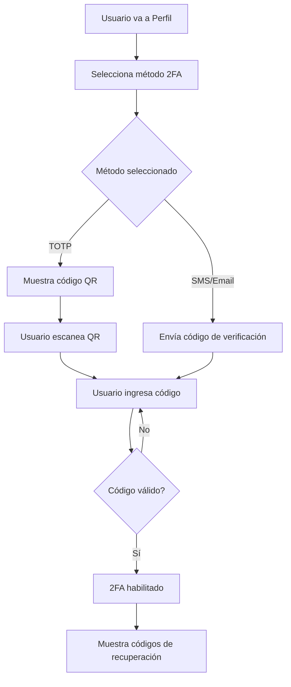
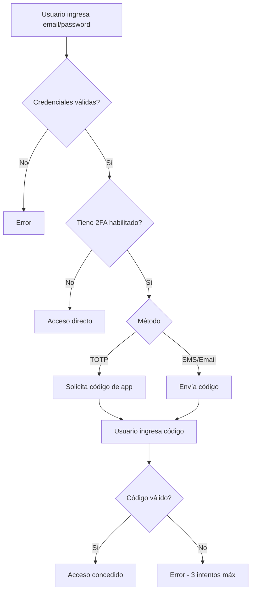

# Autenticación de Dos Factores (2FA) - ArchiveyCloud

## 📋 Índice
1. [Introducción](#introducción)
2. [Características](#características)
3. [Instalación y Configuración](#instalación-y-configuración)
4. [Métodos de Autenticación](#métodos-de-autenticación)
5. [Flujo de Usuario](#flujo-de-usuario)
6. [Uso del Sistema](#uso-del-sistema)
7. [API y Endpoints](#api-y-endpoints)
8. [Seguridad](#seguridad)
9. [Troubleshooting](#troubleshooting)

---

## 🔐 Introducción

El sistema de Autenticación de Dos Factores (2FA) de ArchiveyCloud agrega una capa adicional de seguridad a las cuentas de usuario, cumpliendo con los requisitos normativos REQ-CS-003 del sistema SGDEA.

### Beneficios
- ✅ Protección adicional contra accesos no autorizados
- ✅ Cumplimiento normativo y de seguridad
- ✅ Múltiples métodos de verificación
- ✅ Códigos de recuperación de emergencia
- ✅ Interfaz intuitiva y fácil de usar

---

## ⚡ Características

### Métodos de Autenticación Soportados

1. **TOTP (Time-based One-Time Password)**
   - Aplicaciones compatibles: Google Authenticator, Microsoft Authenticator, Authy
   - Genera códigos cada 30 segundos
   - No requiere conexión a internet

2. **SMS (Mensaje de Texto)**
   - Envío de código de 6 dígitos al teléfono móvil
   - Válido por 5 minutos
   - Opción de reenvío después de 60 segundos

3. **Email (Correo Electrónico)**
   - Código enviado al correo registrado
   - Válido por 5 minutos
   - Opción de reenvío después de 60 segundos

### Funcionalidades Adicionales

- **Códigos de Recuperación**: 10 códigos de un solo uso para emergencias
- **Gestión Completa**: Habilitar, deshabilitar y cambiar métodos
- **Validación de Sesión**: El 2FA se valida por sesión (30 minutos)
- **Auditoría**: Registro completo de intentos y validaciones

---

## 🛠️ Instalación y Configuración

### 1. Requisitos Previos

El paquete `pragmarx/google2fa-qrcode` ya está instalado. Si necesitas reinstalarlo:

```bash
composer require pragmarx/google2fa-qrcode
```

### 2. Migraciones

Ejecuta las migraciones para crear las tablas necesarias:

```bash
php artisan migrate
```

Esto creará las siguientes tablas:
- `two_factor_authentications`: Configuración de 2FA por usuario
- `two_factor_challenges`: Códigos temporales para SMS/Email
- `two_factor_backup_codes`: Códigos de recuperación (tabla opcional)

### 3. Configuración de Middleware

El middleware ya está registrado en `bootstrap/app.php`:

```php
'two-factor' => TwoFactorAuthentication::class,
```

### 4. Configuración de Servicios Externos

#### Para SMS (Twilio u otro proveedor)

Agrega las credenciales en `.env`:

```env
TWILIO_SID=your_account_sid
TWILIO_AUTH_TOKEN=your_auth_token
TWILIO_PHONE_NUMBER=+1234567890
```

Actualiza el método `sendCodeViaSMS` en `TwoFactorAuthenticationService.php`:

```php
public function sendCodeViaSMS(User $user): bool
{
    $twoFactor = $user->twoFactorAuthentication;
    
    if (!$twoFactor || $twoFactor->method !== 'sms') {
        return false;
    }
    
    $code = str_pad((string) random_int(0, 999999), 6, '0', STR_PAD_LEFT);
    
    TwoFactorChallenge::create([
        'user_id' => $user->id,
        'code' => Hash::make($code),
        'method' => 'sms',
        'expires_at' => now()->addMinutes(5),
    ]);
    
    // Integración con Twilio
    $twilio = new \Twilio\Rest\Client(
        config('services.twilio.sid'),
        config('services.twilio.token')
    );
    
    $twilio->messages->create(
        $twoFactor->phone_number,
        [
            'from' => config('services.twilio.from'),
            'body' => "Tu código de verificación es: {$code}\n\nEste código expira en 5 minutos."
        ]
    );
    
    return true;
}
```

#### Para Email

El envío por email ya está configurado usando el sistema de correo de Laravel. Asegúrate de tener configurado SMTP en `.env`:

```env
MAIL_MAILER=smtp
MAIL_HOST=smtp.gmail.com
MAIL_PORT=587
MAIL_USERNAME=tu_correo@gmail.com
MAIL_PASSWORD=tu_contraseña_app
MAIL_ENCRYPTION=tls
MAIL_FROM_ADDRESS=noreply@archiveycloud.com
MAIL_FROM_NAME="ArchiveyCloud Security"
```

---

## 🔑 Métodos de Autenticación

### Método 1: TOTP (Aplicación de Autenticación)

**Ventajas:**
- ✅ Más seguro (códigos generados localmente)
- ✅ No requiere conexión a internet
- ✅ No depende de servicios externos

**Cómo funciona:**
1. Usuario escanea código QR con app de autenticación
2. App genera códigos de 6 dígitos cada 30 segundos
3. Usuario ingresa el código actual al iniciar sesión

**Aplicaciones recomendadas:**
- Google Authenticator (iOS/Android)
- Microsoft Authenticator (iOS/Android)
- Authy (iOS/Android/Desktop)

### Método 2: SMS

**Ventajas:**
- ✅ Familiar para usuarios
- ✅ No requiere app adicional

**Desventajas:**
- ⚠️ Dependiente de cobertura móvil
- ⚠️ Costo de SMS (si aplica)

### Método 3: Email

**Ventajas:**
- ✅ Accesible desde cualquier dispositivo
- ✅ No requiere teléfono móvil

**Desventajas:**
- ⚠️ Dependiente de acceso a correo
- ⚠️ Ligeramente menos seguro que TOTP

---

## 👤 Flujo de Usuario

### Habilitación de 2FA



### Inicio de Sesión con 2FA



---

## 📖 Uso del Sistema

### Para Usuarios

#### 1. Habilitar 2FA

1. Ve a tu **Perfil de Usuario**
2. Accede a la sección **"Autenticación de Dos Factores"**
3. Selecciona un método:
   - **TOTP**: Escanea el código QR con tu app de autenticación
   - **SMS**: Ingresa tu número de teléfono
   - **Email**: Usa tu correo registrado
4. Ingresa el código de verificación que recibas
5. **IMPORTANTE**: Guarda los códigos de recuperación en un lugar seguro

#### 2. Iniciar Sesión con 2FA

1. Ingresa tu email y contraseña normalmente
2. Serás redirigido a la página de verificación 2FA
3. Ingresa el código de 6 dígitos:
   - **TOTP**: Mira tu app de autenticación
   - **SMS/Email**: Revisa tu teléfono o correo
4. Si no recibes el código (SMS/Email), puedes reenviarlo después de 60 segundos

#### 3. Usar Códigos de Recuperación

Si pierdes acceso a tu método 2FA:

1. En la pantalla de verificación 2FA, ingresa uno de tus códigos de recuperación
2. Cada código solo funciona **una vez**
3. Después de usar un código, **regenera nuevos códigos** inmediatamente

#### 4. Deshabilitar 2FA

1. Ve a tu **Perfil de Usuario**
2. En la sección de 2FA, ingresa tu contraseña
3. Haz clic en **"Deshabilitar 2FA"**
4. ⚠️ Esto reducirá la seguridad de tu cuenta

#### 5. Regenerar Códigos de Recuperación

1. Ve a tu **Perfil de Usuario**
2. Ingresa tu contraseña
3. Haz clic en **"Regenerar Códigos de Recuperación"**
4. Guarda los nuevos códigos (los anteriores ya no funcionarán)

### Para Administradores

#### Forzar 2FA para Roles Específicos

En el futuro, se puede agregar una política que obligue a ciertos roles a usar 2FA:

```php
// En un middleware o política
if ($user->hasRole('Administrador') && !$user->hasTwoFactorEnabled()) {
    return redirect()->route('two-factor.settings')
        ->with('warning', 'Los administradores deben habilitar 2FA');
}
```

#### Desactivar 2FA de un Usuario (Emergencia)

Si un usuario pierde acceso completo:

```bash
php artisan tinker
```

```php
$user = User::where('email', 'usuario@email.com')->first();
$user->twoFactorAuthentication()->delete();
```

---

## 🔌 API y Endpoints

### Endpoints Disponibles

#### Configuración de 2FA

```http
GET  /two-factor/settings           # Mostrar configuración
POST /two-factor/enable             # Habilitar 2FA
POST /two-factor/confirm            # Confirmar y activar 2FA
POST /two-factor/disable            # Deshabilitar 2FA
POST /two-factor/recovery-codes/regenerate  # Regenerar códigos
GET  /two-factor/recovery-codes     # Ver códigos restantes
```

#### Challenge de 2FA (Login)

```http
GET  /two-factor/challenge          # Mostrar formulario de verificación
POST /two-factor/verify             # Verificar código
POST /two-factor/resend             # Reenviar código (SMS/Email)
```

### Ejemplos de Uso

#### Habilitar 2FA con TOTP

```javascript
const response = await axios.post('/two-factor/enable', {
    method: 'totp'
});

// Response
{
    "success": true,
    "qr_code": "data:image/png;base64,iVBORw0KGgoAAAA...",
    "secret": "JBSWY3DPEHPK3PXP",
    "message": "Escanea el código QR con tu aplicación de autenticación"
}
```

#### Confirmar 2FA

```javascript
const response = await axios.post('/two-factor/confirm', {
    code: '123456'
});

// Response
{
    "success": true,
    "message": "Autenticación de dos factores activada correctamente"
}
```

#### Verificar Código en Login

```javascript
const response = await axios.post('/two-factor/verify', {
    code: '123456'
});

// Response
{
    "success": true,
    "redirect": "/dashboard"
}
```

---

## 🔒 Seguridad

### Mejores Prácticas Implementadas

1. **Códigos Hasheados**: Todos los códigos se almacenan con hash BCrypt
2. **Expiración**: Los códigos SMS/Email expiran en 5 minutos
3. **Validación de Sesión**: La verificación 2FA se mantiene por 30 minutos
4. **Rate Limiting**: Prevención de fuerza bruta (implementar en producción)
5. **Auditoría**: Todos los intentos se registran en `pista_auditorias`

### Recomendaciones de Seguridad

#### Para Usuarios
- ✅ Usa TOTP cuando sea posible (más seguro)
- ✅ Guarda los códigos de recuperación en un lugar seguro físico
- ✅ Nunca compartas tus códigos de verificación
- ✅ Regenera códigos de recuperación periódicamente
- ⚠️ No uses el mismo método 2FA para múltiples servicios

#### Para Administradores
- ✅ Forzar 2FA para roles administrativos
- ✅ Auditar regularmente los eventos de 2FA
- ✅ Implementar alertas de seguridad ante múltiples intentos fallidos
- ✅ Configurar backups automáticos de la tabla de 2FA
- ✅ Documentar procedimientos de recuperación de acceso

### Configuraciones Adicionales Recomendadas

#### Rate Limiting

Agregar en `app/Http/Kernel.php` o configurar en routes:

```php
Route::post('/two-factor/verify', [TwoFactorChallengeController::class, 'verify'])
    ->middleware('throttle:5,1'); // 5 intentos por minuto
```

#### Notificaciones de Seguridad

Enviar email cuando se habilita/deshabilita 2FA:

```php
// En TwoFactorAuthenticationService
Mail::to($user)->send(new TwoFactorEnabledMail($user));
```

---

## 🐛 Troubleshooting

### Problemas Comunes

#### 1. "Código inválido" con TOTP

**Causas:**
- Reloj del servidor desincronizado
- Reloj del dispositivo desincronizado
- Código ya usado

**Solución:**
```bash
# Verificar hora del servidor
date

# Sincronizar con NTP (si es necesario)
ntpdate -s time.nist.gov
```

#### 2. No recibo SMS/Email

**Causas:**
- Configuración incorrecta de SMTP/SMS
- Código spam/bloqueado
- Email/teléfono incorrecto

**Solución:**
```bash
# Verificar logs
tail -f storage/logs/laravel.log

# Probar envío manual
php artisan tinker
Mail::raw('Test', fn($msg) => $msg->to('test@example.com'));
```

#### 3. Usuario bloqueado sin acceso

**Solución rápida (admin):**
```bash
php artisan tinker
```
```php
$user = User::find(1);
$user->twoFactorAuthentication()->delete();
echo "2FA deshabilitado para {$user->name}";
```

#### 4. QR Code no se muestra

**Causas:**
- Paquete no instalado correctamente
- Error al generar el secreto

**Solución:**
```bash
composer require pragmarx/google2fa-qrcode
php artisan config:clear
php artisan cache:clear
```

#### 5. Códigos de recuperación no funcionan

**Verificar:**
```bash
php artisan tinker
```
```php
$user = User::find(1);
$codes = $user->twoFactorAuthentication->recovery_codes;
dd($codes); // Debe ser un array con 10 códigos hasheados
```

---

## 📊 Monitoreo y Estadísticas

### Consultas Útiles

#### Usuarios con 2FA habilitado

```sql
SELECT 
    u.id,
    u.name,
    u.email,
    tfa.method,
    tfa.enabled,
    tfa.confirmed_at
FROM users u
INNER JOIN two_factor_authentications tfa ON u.id = tfa.user_id
WHERE tfa.enabled = 1;
```

#### Intentos de 2FA fallidos (últimas 24h)

```sql
SELECT 
    usuario_id,
    COUNT(*) as intentos_fallidos
FROM pista_auditorias
WHERE accion = 'intento_2fa_fallido'
AND created_at >= NOW() - INTERVAL 24 HOUR
GROUP BY usuario_id
ORDER BY intentos_fallidos DESC;
```

### Métricas Recomendadas

- Porcentaje de usuarios con 2FA habilitado
- Distribución de métodos de 2FA (TOTP vs SMS vs Email)
- Tasa de intentos fallidos
- Tiempo promedio de verificación
- Uso de códigos de recuperación

---

## 🚀 Próximas Mejoras

### Roadmap

- [ ] Soporte para WebAuthn/FIDO2 (llaves de seguridad físicas)
- [ ] Autenticación biométrica
- [ ] Backup automático de configuraciones 2FA
- [ ] Dashboard de seguridad para usuarios
- [ ] Notificaciones push para verificación
- [ ] Geolocalización de inicios de sesión
- [ ] Dispositivos de confianza (skip 2FA por X días)

---

## 📞 Soporte

Si tienes problemas con la implementación de 2FA:

1. Revisa esta documentación
2. Consulta los logs: `storage/logs/laravel.log`
3. Verifica la configuración de servicios externos (SMTP, SMS)
4. Contacta al equipo de desarrollo

---

## 📝 Changelog

### v1.0.0 (2024-10-08)
- ✅ Implementación inicial de 2FA
- ✅ Soporte para TOTP, SMS y Email
- ✅ Códigos de recuperación
- ✅ Middleware de verificación
- ✅ Interfaz de usuario completa
- ✅ Auditoría de eventos

---

**Desarrollado para ArchiveyCloud - Sistema de Gestión Documental y Archivo Electrónico**
